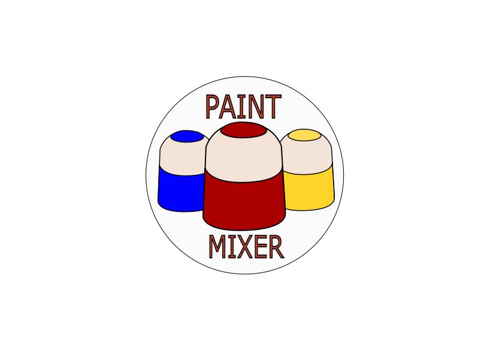

# Paint Mixer

## Overview

The **Paint Mixer** is a warehouse management application written in C++ using the **Qt 6.5** library. The project allows users to manage paints, categorize them, assign them to projects, and export data. The application follows the **MVC design pattern**, ensuring clear separation of concerns, and is fully object-oriented. The graphical interface (GUI) is built using Qt, providing an easy and intuitive way to manage the stock. Data is stored in **JSON** format, and the interface is styled using **QSS**.



## Features

- Add, edit, and remove paints from the inventory.
- Categorize paints and assign them to projects.
- Save and load paint data in JSON format.
- Intuitive graphical interface with filtering options for easy management.
- Export and import projects and associated paints.
- Custom styling using **QSS**.

## Technologies

- **Programming Language**: C++
- **Libraries**: Qt 6.5 (for GUI and data handling)
- **Data Storage**: JSON (for saving paint and project data)
- **Styling**: QSS (for custom UI design)

## Installation and Usage

1. Clone the repository:
   ```bash
   git clone https://github.com/Szak007/Paint_Mixer.git
   ```
2. Ensure you have Qt 6.5 installed on your system.

3. Compile the project using `qmake` and `make`:

   ```bash
   qmake
   make
   ```

4. Run the application:
   ```bash
   ./Paint_Mixer
   ```

## Project Structure

- **main.cpp**: Entry point for the application.
- **Color.h / Color.cpp**: Manages paint properties such as name, hex code, and description.
- **Paint_Mixer.h / Paint_Mixer.cpp**: The main window of the application.
- **Paint_Widget.h / Paint_Widget.cpp**: Manages the paint inventory interface.
- **Project.h / Project.cpp**: Handles project management and paint assignment.
- **Project_List_Widget.h / Project_List_Widget.cpp**: Displays and manages the list of projects.
- **Project_Widget.h / Project_Widget.cpp**: Manages project details and assigned paints.
- **styles.qss**: Defines the custom style for the application's interface.

## Skills Demonstrated

- **Object-Oriented Programming**: Extensive use of OOP principles in C++.
- **MVC Design Pattern**: Clear separation of concerns between data, logic, and interface.
- **JSON Data Handling**: Saving and loading data using JSON format.
- **GUI Design with Qt**: Creation of a responsive and intuitive interface using Qt Widgets.
- **QSS Styling**: Customizing the look and feel of the interface using Qt's QSS.

## Future Improvements

- Add more advanced filtering and searching options for paints and projects.
- Implement user accounts and database integration for managing personal projects and paint collections.
- Introduce a color wheel feature for creating custom colors through mixing.
- Enable users to upload multiple images and videos to document painting projects.
- Add a feature that allows users to paint on images using the colors from their paint catalog, providing a virtual preview before applying paints in real life.
